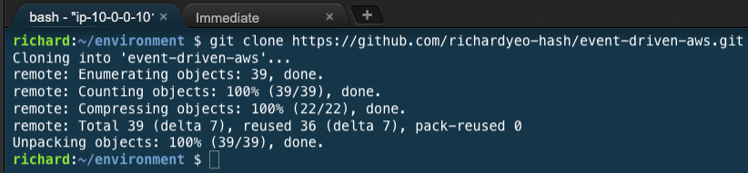
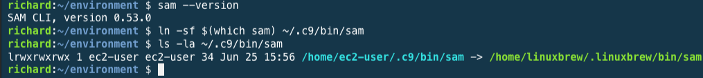
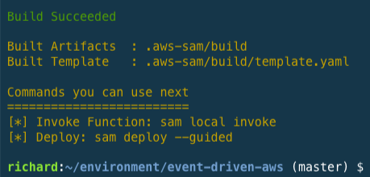
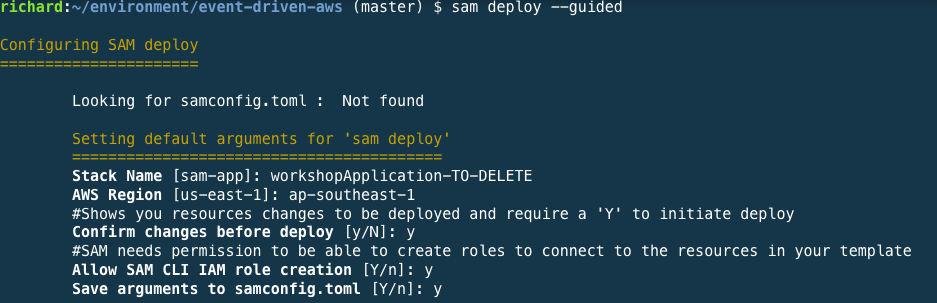
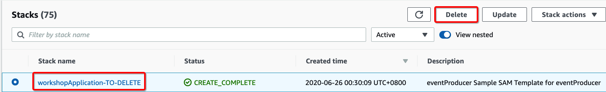
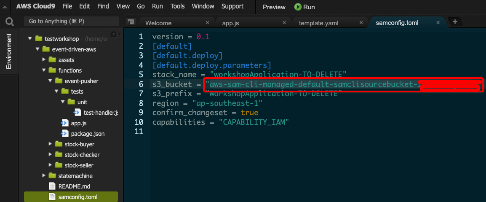
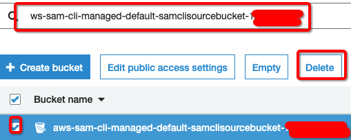
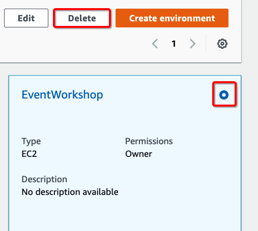

# Event Driven Architecture on AWS


## Before starting

Read the following lists of preparations that you need to do.

1. Have an AWS Account with Admin access ready for console access.
2. **Nothing** in this lab will be done outside of your browser.

## Chapter 1: Creating cloud based development environment using AWS Cloud9

1. Sign in to the AWS Cloud9 console as follows:
    
    If you're the only individual using your AWS account, go to https://console.aws.amazon.com/cloud9/.

2. After you sign in to the AWS Cloud9 console, in the top navigation bar, choose an AWS Region to create the environment in.

    Make sure to use **Singapore (ap-southeast-1)**

    
3. Choose the large Create environment button in one of the locations shown below.

    If you have no AWS Cloud9 environments yet, the button is shown on a welcome page.

    

    If you already have AWS Cloud9 environments, the button is shown as follows.

    

4. On the Name environment page, for Name, enter a name for your environment. For this tutorial, use my-demo-environment.

5. For Description, enter something about your environment. For this tutorial, use This environment is for the AWS Cloud9 tutorial.

6. Choose Next step.

7. On the Configure settings page, for Environment type, choose Create a new instance for environment (EC2).

8. For Instance type, leave the default choice. This choice has relatively low RAM and vCPUs, which is sufficient for this tutorial.

9. For Platform, choose Amazon Linux. AWS Cloud9 creates the instance and then connects the environment to it.

10. Leave default value for Cost-saving setting. When all web browser instances that are connected to the IDE for the environment are closed, AWS Cloud9 waits this amount of time and then shuts down the Amazon EC2 instance for the environment.

11. Expand Network settings (advanced).

    AWS Cloud9 uses Amazon Virtual Private Cloud (Amazon VPC) to communicate with the newly created Amazon EC2 instance. For this tutorial, we recommend that you don't change the preselected default settings. With the default settings, AWS Cloud9 attempts to automatically use the default VPC with its single subnet in the same AWS account and AWS Region as the new environment.

    If you are familiar with the VPC situation in your account, choose a VPC and a public subnet.

    If you see a red exclamation mark, you need to choose proper VPC. If you are not sure, please create a proper VPC by following this [guide](https://docs.aws.amazon.com/vpc/latest/userguide/vpc-getting-started.html). **Do only "step 1:Create the VPC" and use that VPC to complete step 11**

12. Choose Next step.

13. On the Review page, choose Create environment. Wait while AWS Cloud9 creates your environment. This can take several minutes.

14. After AWS Cloud9 creates your environment, it displays the AWS Cloud9 IDE for the environment.

## Chapter 2: Using templates do deploy sample application

1. From this step onwards, type/copy commands into window highlighted below
    

2. Enter the following command

    ```cli

    git clone https://github.com/richardyeo-hash/event-driven-aws.git
    ```

    Press enter.
    You should see messaages such as unpacking objects.

    

3. Run following command

    ```commandline
    echo -ne '\n' | sh -c "$(curl -fsSL https://raw.githubusercontent.com/Linuxbrew/install/master/install.sh)" -y
    test -d ~/.linuxbrew && eval $(~/.linuxbrew/bin/brew shellenv)
    test -d /home/linuxbrew/.linuxbrew && eval $(/home/linuxbrew/.linuxbrew/bin/brew shellenv)
    test -r ~/.bash_profile && echo "eval \$($(brew --prefix)/bin/brew shellenv)" >>~/.bash_profile
    echo "eval \$($(brew --prefix)/bin/brew shellenv)" >>~/.profile
    npm uninstall -g aws-sam-local
    sudo pip uninstall aws-sam-cli -y
    rm -rf $(which sam)
    brew tap aws/tap
    brew install aws-sam-cli
    sam --version
    ln -sf $(which sam) ~/.c9/bin/sam 
    ls -la ~/.c9/bin/sam
    ```

    Press enter.

    Verify that you get output like below.

    

4. Run following command

    ```command
    cd event-drivent-aws
    sam build
    ```

    Verify that you get output like below.

    

5. Run the following command 

    ```command
    sam deploy --guided
    ```
    
    Press enter.

    Fill in values as shown in the example below
    

    When asked if you would like to **Deploy this changeset?**, press y and then enter.

## Clean up

By default, there are events published every minute, which may incur additional charges.
Once you are done with this lab, use this chapter to clean up.

1. Go to [CloudFormation console](https://ap-southeast-1.console.aws.amazon.com/cloudformation/home?region=ap-southeast-1)

2. Select CloudFormation template with TO-DELETE in the name.

3. Click delete.

    

4. Go to Cloud9 console and search for S3 name. Take note of the name.

    

5. Go to [S3 console](https://s3.console.aws.amazon.com/s3/home?region=ap-southeast-1)

    **WARNING! IF YOU HAVE PRODUCTION WORKLOAD BASED ON SAM, SKIP THIS STEP! THIS MAY CAUSE PRODUCTION IMPACT**

    Search for the S3 bucket and delete it.

    

6. Go to [Cloud9 console](https://ap-southeast-1.console.aws.amazon.com/cloud9/home?region=ap-southeast-1)

7. Look for your Cloud9 instance and delete it

    

