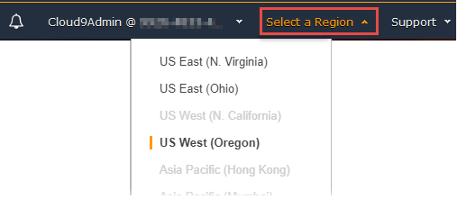
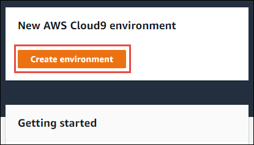
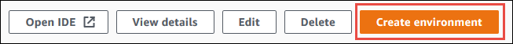
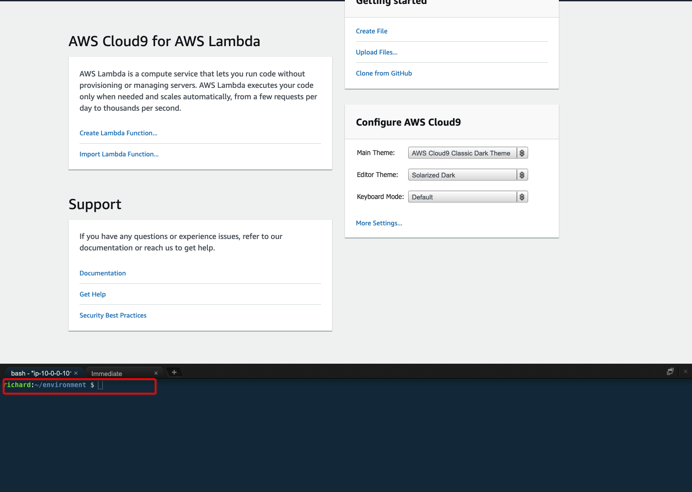

# Event Driven Architecture on AWS

## Before starting

Read the following lists of preparations that you need to do.

1. Have an AWS Account with Admin access ready for console access.
2. **Nothing** in this lab will be done outside of your browser.

## Chapter 1: Creating cloud based development environment using AWS Cloud9

1. Sign in to the AWS Cloud9 console as follows:
    
    If you're the only individual using your AWS account, go to https://console.aws.amazon.com/cloud9/.

2. After you sign in to the AWS Cloud9 console, in the top navigation bar, choose an AWS Region to create the environment in.

    Make sure to use **Singapore (ap-southeast-1)**

    
3. Choose the large Create environment button in one of the locations shown below.

    If you have no AWS Cloud9 environments yet, the button is shown on a welcome page.

    

    If you already have AWS Cloud9 environments, the button is shown as follows.

    

4. On the Name environment page, for Name, enter a name for your environment. For this tutorial, use my-demo-environment.

5. For Description, enter something about your environment. For this tutorial, use This environment is for the AWS Cloud9 tutorial.

6. Choose Next step.

7. On the Configure settings page, for Environment type, choose Create a new instance for environment (EC2).

8. For Instance type, leave the default choice. This choice has relatively low RAM and vCPUs, which is sufficient for this tutorial.

9. For Platform, choose Amazon Linux. AWS Cloud9 creates the instance and then connects the environment to it.

10. Leave default value for Cost-saving setting. When all web browser instances that are connected to the IDE for the environment are closed, AWS Cloud9 waits this amount of time and then shuts down the Amazon EC2 instance for the environment.

11. Expand Network settings (advanced).

    AWS Cloud9 uses Amazon Virtual Private Cloud (Amazon VPC) to communicate with the newly created Amazon EC2 instance. For this tutorial, we recommend that you don't change the preselected default settings. With the default settings, AWS Cloud9 attempts to automatically use the default VPC with its single subnet in the same AWS account and AWS Region as the new environment.

    If you are familiar with the VPC situation in your account, choose a VPC and a public subnet.

    If you see a red exclamation mark, you need to choose proper VPC. If you are not sure, please create a proper VPC by following this [guide](https://docs.aws.amazon.com/vpc/latest/userguide/vpc-getting-started.html). **Do only "step 1:Create the VPC" and use that VPC to complete step 11**

12. Choose Next step.

13. On the Review page, choose Create environment. Wait while AWS Cloud9 creates your environment. This can take several minutes.

14. After AWS Cloud9 creates your environment, it displays the AWS Cloud9 IDE for the environment.

## Chapter 2: Using templates do deploy sample application

1. From this step onwards, type/copy commands into window highlighted below
    

## Resources

See the [AWS SAM developer guide](https://docs.aws.amazon.com/serverless-application-model/latest/developerguide/what-is-sam.html) for an introduction to SAM specification, the SAM CLI, and serverless application concepts.

Next, you can use AWS Serverless Application Repository to deploy ready to use Apps that go beyond hello world samples and learn how authors developed their applications: [AWS Serverless Application Repository main page](https://aws.amazon.com/serverless/serverlessrepo/)
